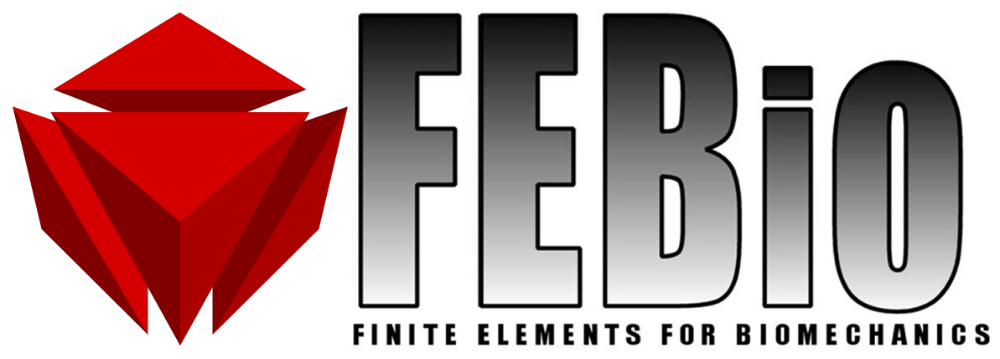

<!--  -->

FEBio is a nonlinear finite element (FE) solver that is specifically designed for biomechanical applications. It offers modeling scenarios, constitutive models and boundary conditions that are relevant to many research areas in biomechanics. All features can be used together seamlessly, giving the user a powerful tool for solving 3D problems in computational biomechanics. The software is open-source, and pre-compiled executables for Windows, OS-X and Linux platforms are available.

Executables for FEBio can be downloaded from https://febio.org/febio/febio-downloads/.  Please inform us of publications that use FEBio in research.  Information can be found on the Publications tab.  

Support forums can be found at https://forums.febio.org/.

# Build Guide 

Refer to [BUILD](BUILD.md)

# Contributing 

Refer to [CONTRIBUTING](CONTRIBUTING.md)

# Code of conduct 

Refer to [CODE_OF_CONDUCT](CODE_OF_CONDUCT.md)
